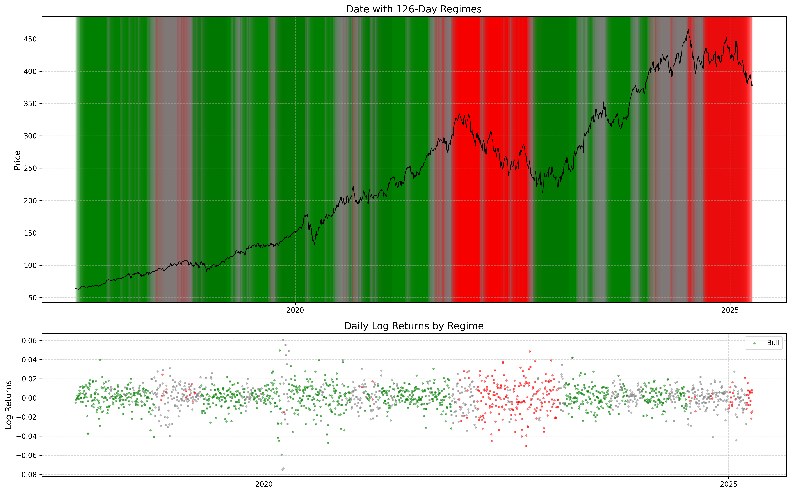
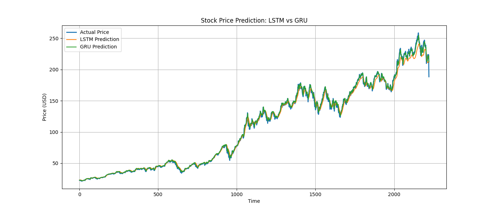

# Market Regime Detection using Wesserstein Kmeans

## Overview

This project implements the This project develops an algorithmic trading system combining LSTM/GRU-based price forecasting and K-means regime classification to generate Buy/Sell/Hold signals. 

## Models Utilized
###Deep Learning: LSTM and GRU networks for price forecasting.
###Supervised Learning: Wasserstein distance-based K-means for regime detection.
## Features

- Implements Simple Moving Averages (SMA) and Exponential Moving Averages (EMA) for trading signals
- Visualization of moving averages and trade signals
- Performance evaluation using cumulative returns for EMA and SMA

## Dataset

The strategy is tested on historical market data of Apple (AAPL) using **yfinance**.

## Outcomes & Visual Insights

### Market Regime Detection

### LSTM vs GRU Predictions along with actual price graph

## Future Improvements

- Deploying a finished streamlit app that takes in user input as ticker symbol and dates (start,end) and provides Buy/Sell/Hold Signals which can also be downloaded as CSV files or PDFs.
- Going further on incorporating trading methodologies
- Adding risk management features
- Addition of <strong>RL Agent<strong>

## Contributing

Contributions are welcome! Feel free to fork the repo, create a branch, and submit a pull request.
